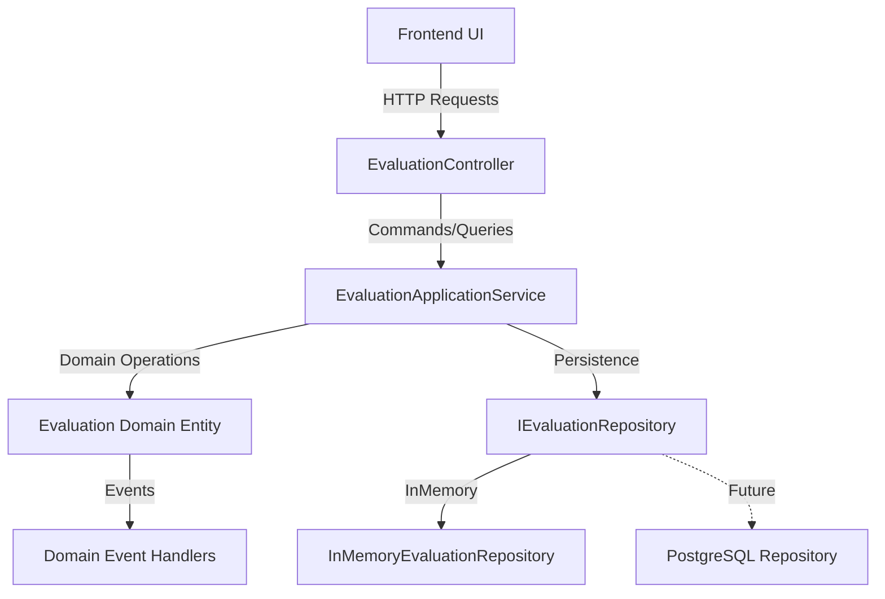
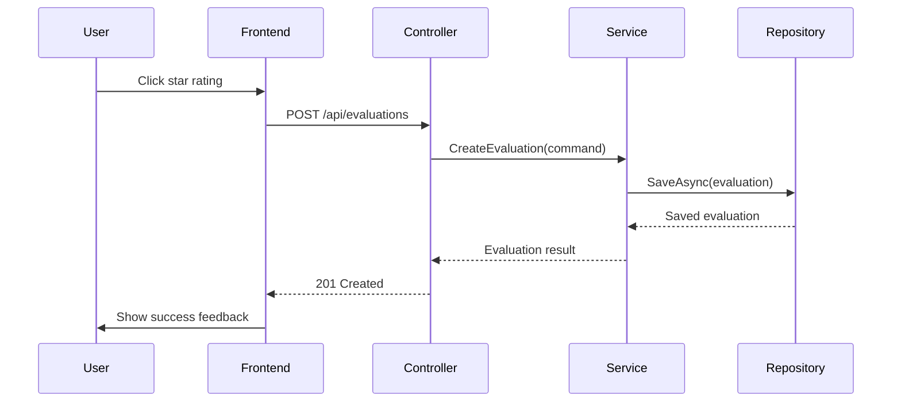

## Implementation Plan for Ranking System

Based on the current architecture and your preference for in-memory storage with future PostgreSQL integration, here's my comprehensive plan:

### Architecture Overview

### Detailed Implementation Steps

#### 1. **Domain Layer (Core)**
- **Evaluation Entity**: Create [`Evaluation.cs`](ModelComparisonStudio.Core/Entities/Evaluation.cs:1) with properties matching user story requirements
- **Value Objects**: Create [`EvaluationId.cs`](ModelComparisonStudio.Core/ValueObjects/EvaluationId.cs:1) and [`CommentText.cs`](ModelComparisonStudio.Core/ValueObjects/CommentText.cs:1)
- **Repository Interface**: Define [`IEvaluationRepository.cs`](ModelComparisonStudio.Core/Interfaces/IEvaluationRepository.cs:1) with CRUD operations

#### 2. **Application Layer**
- **Evaluation DTOs**: Create [`EvaluationDto.cs`](ModelComparisonStudio.Application/DTOs/EvaluationDto.cs:1) and related DTOs
- **Application Service**: Implement [`EvaluationApplicationService.cs`](ModelComparisonStudio.Application/Services/EvaluationApplicationService.cs:1) with business logic
- **Use Cases**: Create use cases for evaluation operations

#### 3. **Infrastructure Layer**
- **InMemory Repository**: Implement [`InMemoryEvaluationRepository.cs`](ModelComparisonStudio.Infrastructure/Repositories/InMemoryEvaluationRepository.cs:1)
- **Future PostgreSQL Support**: Create migration-ready repository structure

#### 4. **API Layer**
- **Evaluation Controller**: Create [`EvaluationController.cs`](ModelComparisonStudio/Controllers/EvaluationController.cs:1) with endpoints:
  - `POST /api/evaluations` - Create evaluation
  - `PUT /api/evaluations/{id}` - Update evaluation
  - `GET /api/evaluations` - List evaluations with filtering

#### 5. **Frontend Integration**
- **State Management**: Enhance [`app.js`](ModelComparisonStudio/wwwroot/js/app.js:1) to handle evaluation state
- **Comment System**: Implement auto-save with debouncing
- **UI Feedback**: Add visual states (saving, saved, error)
- **Validation**: Client-side validation for ratings and comments

#### 6. **Data Flow Implementation**

### Key Technical Decisions

1. **In-Memory Storage**: Using concurrent dictionaries for thread safety during development
2. **Debounced Auto-save**: 500ms delay for comment saves to reduce API calls
3. **Validation**: Both client-side (immediate feedback) and server-side (data integrity)
4. **Error Handling**: Comprehensive error responses with user-friendly messages
5. **Future Proofing**: Repository pattern allows easy switch to PostgreSQL

### Performance Considerations

- **Response Times**: Target <200ms for evaluation operations
- **Memory Usage**: In-memory storage suitable for development, with clear path to persistent storage
- **Concurrency**: Thread-safe collections for in-memory repository
- **Caching**: Session storage for frontend state persistence

Would you like me to proceed with implementing any specific part of this plan, or would you like to discuss any modifications to the approach?